# SubGuard - AI-Powered Financial Protection

**SubGuard** is a comprehensive subscription management and purchase protection platform that combines a React dashboard with a Chrome extension to help users take control of their spending behavior through AI-powered interventions.

**Contributors:**
* Katrina Siegfried
* Jeremy Merich
* Nick Rocha
* Claude Code


---

## Table of Contents

- [Overview](#overview)
- [Key Features](#key-features)
- [Quick Start](#quick-start)
- [Documentation](#documentation)
- [Project Structure](#project-structure)
- [Tech Stack](#tech-stack)
- [API Reference](#api-reference)
- [Troubleshooting](#troubleshooting)
- [Team Development](#team-development)

---

## Overview

SubGuard addresses the challenge of subscription fatigue and impulse spending by providing:

1. **Real-time shopping behavior monitoring** via a Chrome extension
2. **AI autonomy levels** that let users choose how much control to delegate
3. **Virtual card masking** to protect payment details on subscription sites
4. **Automated price negotiation** for existing subscriptions
5. **Purchase blocking rules** based on merchant, category, or amount

### System Architecture

```mermaid
graph TB
    subgraph "👤 User's Browser"
        EXT["🧩 Chrome Extension<br/><i>content.js + background.js</i>"]
        DASH["📊 React Dashboard<br/><i>localhost:5173</i>"]
    end

    subgraph "🖥️ Local Server"
        API["⚡ Express API<br/><i>localhost:3001</i>"]
        STORE[("💾 In-Memory Store<br/><i>Settings, Cards, Analytics</i>")]
    end

    subgraph "🌐 External Sites"
        SHOP["🛒 Shopping Sites<br/><i>Amazon, Target, etc.</i>"]
    end

    EXT -->|"Monitor & Analyze"| SHOP
    EXT <-->|"Sync Data & Check Rules"| API
    DASH <-->|"Display & Configure"| API
    API <--> STORE

    style EXT fill:#4285f4,color:#fff
    style DASH fill:#34a853,color:#fff
    style API fill:#fbbc04,color:#000
    style SHOP fill:#ea4335,color:#fff
```



### Data Flow: How It Works


### Card Masking Flow

```mermaid
sequenceDiagram
    participant U as 👤 User
    participant P as 💳 Payment Form
    participant E as 🧩 Extension
    participant A as ⚡ API Server

    U->>P: Navigate to payment page
    E->>E: Detect card input fields
    E->>P: Show "Use SubGuard" prompt

    U->>E: Click prompt
    E->>E: Generate virtual card<br/>(Luhn-valid, merchant-locked)
    E->>P: Autofill card fields
    E->>A: POST /cards/merchant (sync)

    Note over U,A: 🛡️ Real card never exposed to merchant
```



### Autonomy Decision Engine

```mermaid
flowchart LR
    subgraph "📥 Input"
        REQ["Checkout Request<br/>• Price: $X<br/>• Time on site<br/>• Risk level"]
    end

    subgraph "🧠 AI Decision Engine"
        CHK{Autonomy<br/>Level?}
        CHK -->|Minimal/Moderate| ALLOW["✅ Allow"]
        CHK -->|High/Full| RULES

        RULES{Check Rules}
        RULES -->|"Price > Limit"| BLOCK["🚫 Block"]
        RULES -->|"Time > Max"| REDIRECT["↩️ Redirect"]
        RULES -->|"All OK"| ALLOW
    end

    subgraph "📤 Output"
        BLOCK --> OVR["Show Overlay"]
        REDIRECT --> NAV["Navigate Away"]
        ALLOW --> PROC["Proceed"]
    end

    REQ --> CHK
```



---

## Key Features

| Feature | Description |
|---------|-------------|
| **Purchase Blocking** | Set rules to automatically block purchases by merchant, category, or amount |
| **Card Masking** | Generate virtual cards for subscriptions with automatic autofill |
| **Auto-Negotiation** | AI-powered subscription price negotiation |
| **AI Autonomy Levels** | 4 levels from "observe only" to "full AI control" |
| **Browser Extension** | Real-time shopping detection, dark pattern alerts, checkout interception |

### AI Autonomy Levels

| Level | Behavior |
|-------|----------|
| **Minimal** | Observe and track only - no interventions |
| **Moderate** | Gentle nudges and risk warnings only |
| **High** | Active intervention: blocks checkouts above price threshold, enforces time limits |
| **Full** | Complete AI control with automatic redirects and strict limit enforcement |

---

## Quick Start

### Prerequisites

- Node.js 18+
- npm or yarn
- Google Chrome (for extension)

### 1. Install Dependencies

```bash
git clone https://github.com/jmerich/mgmt8130.git
cd mgmt8130
npm install
```

### 2. Start the Application

```bash
# Start web app + API server (recommended for demo)
npm run dev:web
```

This launches:
- **Frontend**: http://localhost:5173
- **API Server**: http://localhost:3001

### 3. Install Chrome Extension

1. Open Chrome and navigate to `chrome://extensions/`
2. Enable **Developer mode** (toggle in top-right)
3. Click **Load unpacked**
4. Select the `chrome-extension/` folder from this project
5. Pin the SubGuard extension to your toolbar

### 4. Verify Setup

- Open http://localhost:5173 - you should see the SubGuard dashboard
- The "Extension Connected" status should turn green after installing the extension
- Visit any shopping site (Amazon, Target, etc.) to see activity tracking

---

## Documentation

| Document | Description |
|----------|-------------|
| [Demo Guide](docs/DEMO-GUIDE.md) | 4-minute live demo workflow |
| [Architecture](docs/ARCHITECTURE.md) | System architecture and diagrams |
| This README | Overview and quick start |

---

## Project Structure

```
mgmt8130/
├── chrome-extension/           # Browser extension (Manifest V3)
│   ├── manifest.json           # Extension configuration
│   ├── background.js           # Service worker - data aggregation
│   ├── content.js              # Page analysis & interventions
│   ├── config.js               # Extension configuration
│   ├── popup.html/css/js       # Extension popup UI
│   └── styles/overlay.css      # Intervention overlay styles
│
├── src/
│   ├── api-server.js           # Express API for extension communication
│   ├── config.ts               # Centralized app configuration
│   ├── shared/                 # Shared types and defaults
│   │   └── autonomy-defaults.json
│   │
│   ├── electron/               # Electron main process (desktop app)
│   │
│   └── renderer/               # React frontend
│       ├── App.tsx             # Main app with dashboard
│       ├── App.css             # Global styles
│       ├── components/         # Shared components (Toast, etc.)
│       ├── services/           # API & stub services
│       └── features/           # Feature modules
│           ├── purchase-blocking/   # Purchase rules management
│           ├── card-masking/        # Virtual card generation
│           ├── auto-negotiation/    # Subscription negotiation
│           └── demo/                # Mock pages for demos
│
├── docs/                       # Documentation
│   ├── DEMO-GUIDE.md           # Live demo instructions
│   └── ARCHITECTURE.md         # Architecture documentation
│
└── package.json
```

---

## Tech Stack

| Layer | Technology |
|-------|------------|
| **Frontend** | React 18, TypeScript, React Router 6 |
| **Desktop** | Electron 28 |
| **Build** | Vite 5 |
| **API** | Express.js |
| **Extension** | Chrome Manifest V3 |
| **Styling** | CSS (custom design system) |

---

## API Reference

The API server runs on `http://localhost:3001`.

### Extension Endpoints

| Endpoint | Method | Description |
|----------|--------|-------------|
| `/api/health` | GET | Health check |
| `/api/extension/sync` | POST | Sync extension data |
| `/api/extension/data` | GET | Get aggregated extension data |
| `/api/extension/page-analysis` | POST | Submit page analysis |

### Autonomy Endpoints

| Endpoint | Method | Description |
|----------|--------|-------------|
| `/api/autonomy/settings` | GET | Get current settings |
| `/api/autonomy/settings` | POST | Update settings |
| `/api/autonomy/check` | POST | Check if action is allowed |

### Card Masking Endpoints

| Endpoint | Method | Description |
|----------|--------|-------------|
| `/api/cards/merchant` | GET | List all merchant cards |
| `/api/cards/merchant` | POST | Sync merchant card |
| `/api/cards/merchant/:domain` | GET | Get card for domain |
| `/api/cards/autofill` | POST | Record autofill event |

### Example: Update Autonomy Settings

```bash
curl -X POST http://localhost:3001/api/autonomy/settings \
  -H "Content-Type: application/json" \
  -d '{"settings": {"level": "full", "dailySpendingLimit": 100}}'
```

---

## Available Scripts

| Command | Description |
|---------|-------------|
| `npm run dev:web` | Start web app + API server (recommended) |
| `npm run dev` | Start full Electron app + renderer + API |
| `npm run dev:renderer` | Start only the Vite dev server |
| `npm run dev:api` | Start only the API server |
| `npm run build` | Build production Electron app |
| `npm run test` | Run tests |
| `npm run lint` | Run ESLint |

---

## Troubleshooting

### Port Already in Use

```bash
# Kill processes on ports 5173 and 3001
lsof -ti:5173 -ti:3001 | xargs kill -9
```

### Extension Not Connecting

1. Ensure API server is running (`npm run dev:web`)
2. Check the console for connection errors
3. Reload the extension in `chrome://extensions/`

### Extension Not Blocking Checkouts

1. Set autonomy to **High** or **Full** in the dashboard
2. Set "Block Checkout Above" to a low value (e.g., $1)
3. Reload the extension and refresh the shopping page
4. Check DevTools console for `[SubGuard]` logs

### "Extension context invalidated" Errors

These appear when reloading the extension - harmless. Just refresh the page.

---

## Team Development

### Feature Assignments

| Feature | Directory | Description |
|---------|-----------|-------------|
| **Purchase Blocking** | `src/renderer/features/purchase-blocking/` | Rules management UI |
| **Card Masking** | `src/renderer/features/card-masking/` | Virtual card generation |
| **Auto-Negotiation** | `src/renderer/features/auto-negotiation/` | Subscription negotiation |

### Development Workflow

1. Each developer works in their feature directory
2. Shared types are in `src/shared/`
3. Use stub services for mock data during development
4. API server handles extension communication
5. Test with the Chrome extension loaded

---

## License

MIT License - see LICENSE file for details.

---

*MGMT 8130 Project - AI-Powered Financial Protection*
