# SubGuard Architecture

Technical architecture documentation for the SubGuard platform.

**Related Documentation:**
- [Main README](../README.md) - Overview and quick start
- [Demo Guide](DEMO-GUIDE.md) - 4-minute live demo workflow

---

## Table of Contents

- [System Overview](#system-overview)
- [Component Architecture](#component-architecture)
- [Data Flow](#data-flow)
- [Chrome Extension Architecture](#chrome-extension-architecture)
- [API Server Architecture](#api-server-architecture)
- [Frontend Architecture](#frontend-architecture)
- [Autonomy System](#autonomy-system)
- [Security Considerations](#security-considerations)

---

## System Overview

SubGuard consists of three main components that work together:

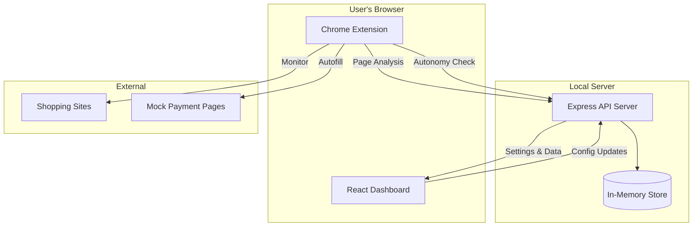

### Component Responsibilities

| Component | Responsibility |
|-----------|---------------|
| **Chrome Extension** | Page monitoring, checkout interception, card autofill, overlay display |
| **API Server** | Data aggregation, autonomy rule evaluation, settings storage |
| **React Dashboard** | User interface, settings management, analytics display |

---

## Component Architecture

### High-Level Architecture

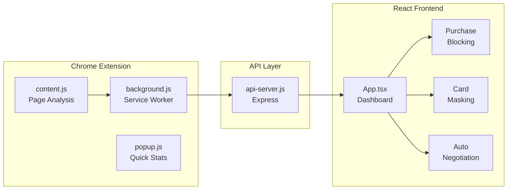

---

## Data Flow

### Shopping Detection & Intervention Flow

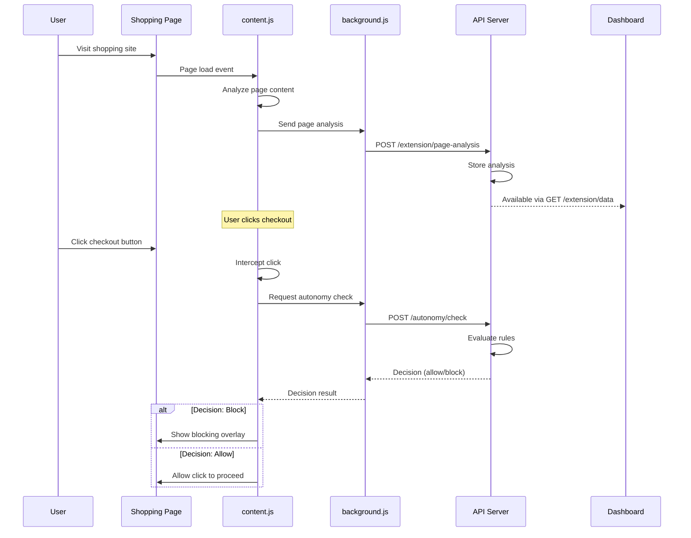

### Card Masking Autofill Flow

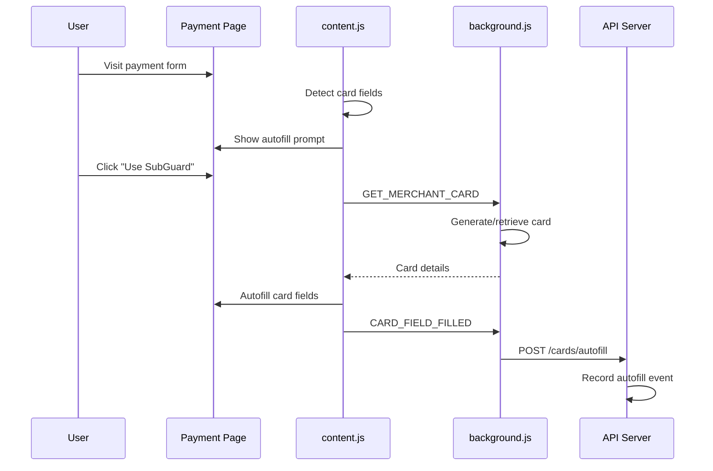

---

## Chrome Extension Architecture

### File Structure

```
chrome-extension/
├── manifest.json       # Extension manifest (V3)
├── background.js       # Service worker
├── content.js          # Content script (injected into pages)
├── config.js           # Configuration
├── popup.html/css/js   # Extension popup UI
├── styles/
│   └── overlay.css     # Intervention overlay styles
└── icons/              # Extension icons
```

### Content Script (content.js)

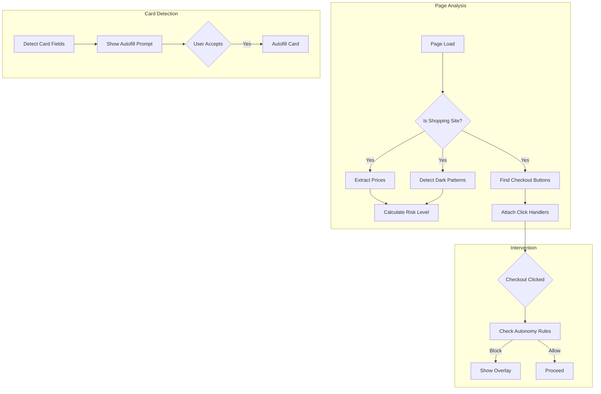

### Background Service Worker (background.js)

Responsibilities:
- **Data Aggregation**: Collects and stores session data
- **API Communication**: Syncs with the Express server
- **Card Storage**: Manages virtual card generation and storage
- **Message Handling**: Routes messages between content scripts and API

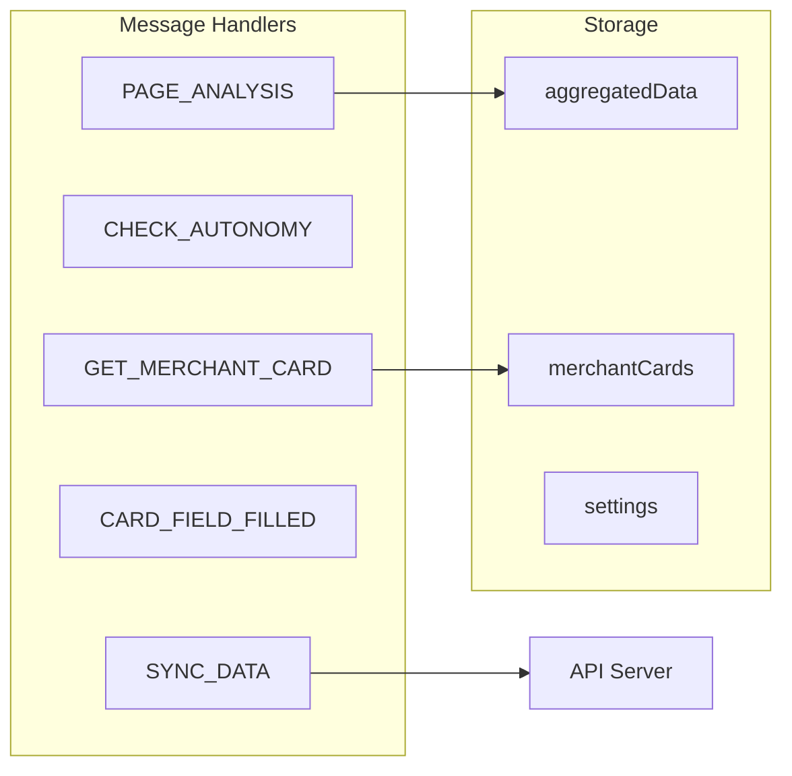

---

## API Server Architecture

### Endpoint Structure

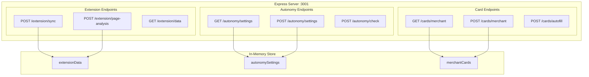

### Autonomy Check Logic

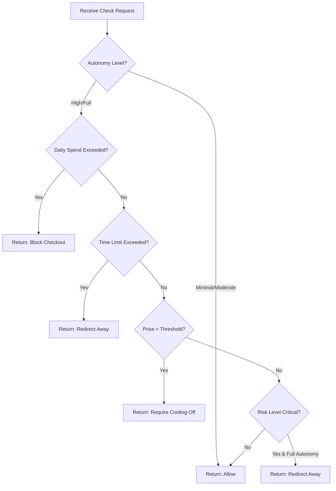

---

## Frontend Architecture

### React Component Hierarchy

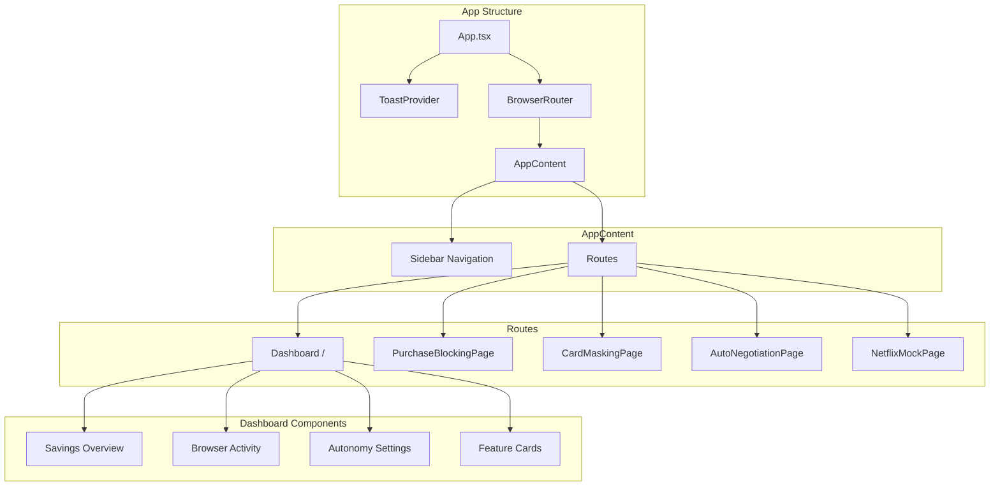

### State Management

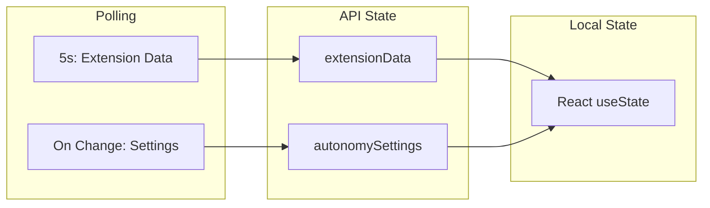

---

## Autonomy System

### Autonomy Levels Comparison

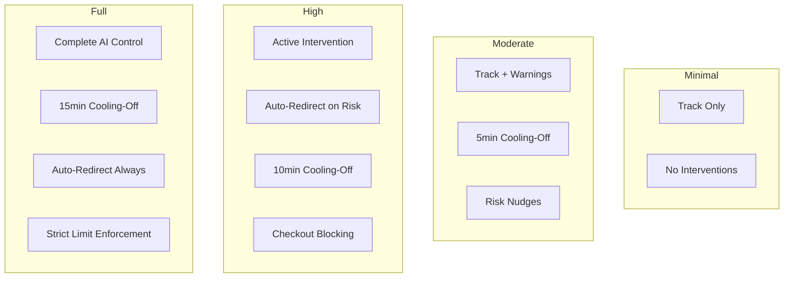

### Settings Schema

```typescript
interface AutonomySettings {
  level: 'minimal' | 'moderate' | 'high' | 'full';
  dailySpendingLimit: number;      // $ amount
  maxShoppingTime: number;         // minutes
  blockCheckoutAbove: number;      // $ threshold
  autoRedirectOnRisk: boolean;
  enforceCoolingOff: boolean;
  coolingOffMinutes: number;
}
```

---

## Security Considerations

### Data Flow Security

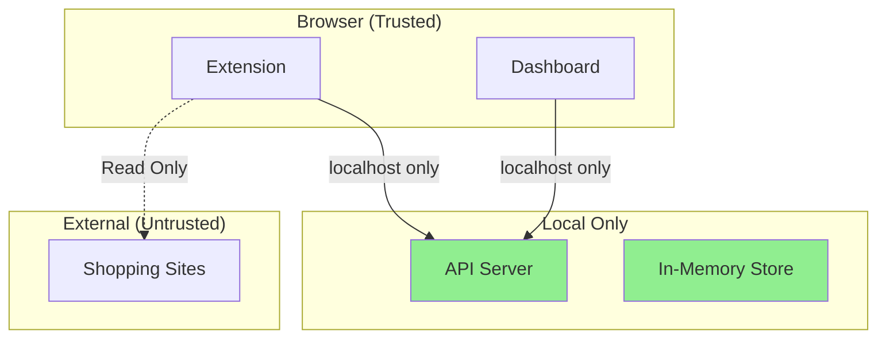

### Key Security Features

| Feature | Implementation |
|---------|---------------|
| **No External Data Transmission** | All data stays on localhost |
| **Card Data Isolation** | Virtual cards stored locally in extension |
| **Content Script Isolation** | Runs in isolated world from page scripts |
| **CORS Protection** | API only accepts requests from known origins |

### Virtual Card Security

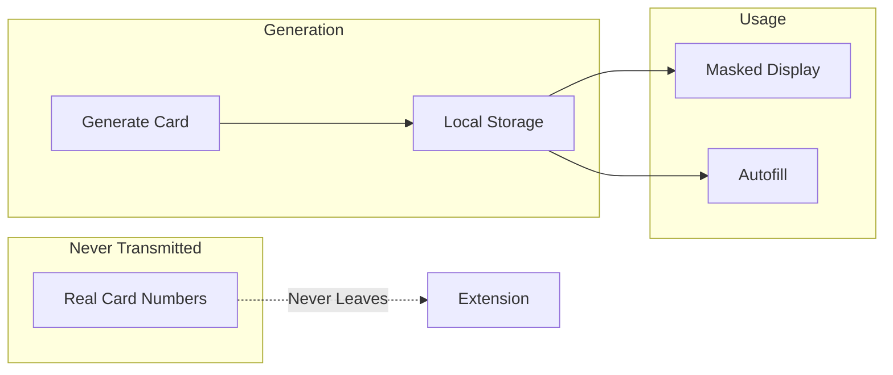

---

## File Reference

### Key Files and Their Purposes

| File | Purpose |
|------|---------|
| `chrome-extension/content.js` | Page analysis, checkout interception, overlays |
| `chrome-extension/background.js` | Data aggregation, API sync, card storage |
| `chrome-extension/config.js` | Extension configuration |
| `src/api-server.js` | Express API server |
| `src/config.ts` | Centralized app configuration |
| `src/renderer/App.tsx` | Main dashboard and routing |
| `src/renderer/features/*/` | Feature-specific components |

### Configuration Files

| File | Purpose |
|------|---------|
| `package.json` | Dependencies and scripts |
| `vite.config.ts` | Vite build configuration |
| `tsconfig.json` | TypeScript configuration |
| `chrome-extension/manifest.json` | Extension manifest |

---

## Deployment Architecture

### Development Mode

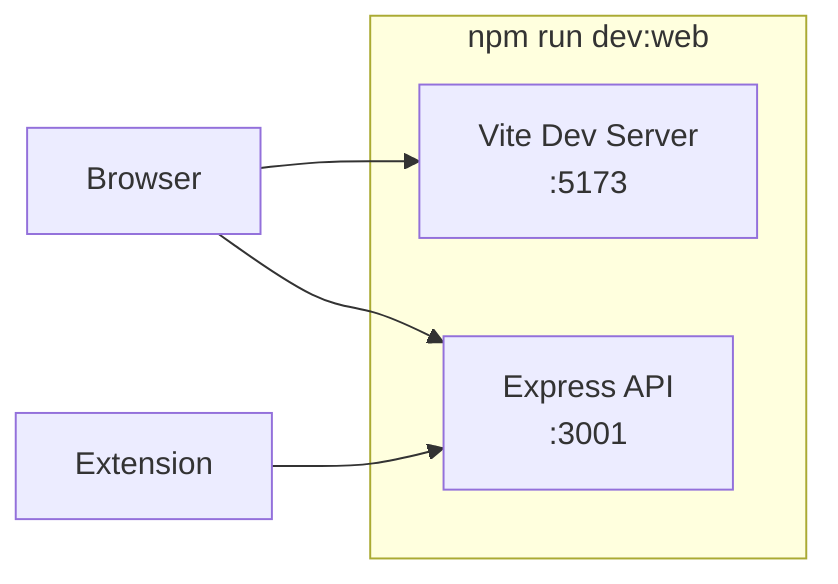

### Production Mode (Electron)

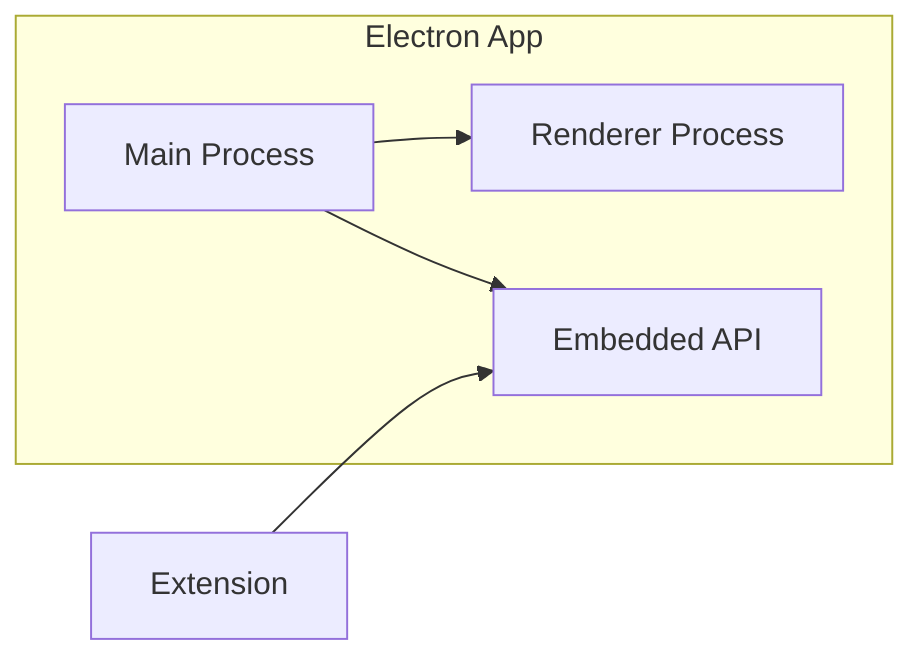

---

*For demo instructions, see [DEMO-GUIDE.md](DEMO-GUIDE.md)*
*For quick start, see [README.md](../README.md)*
